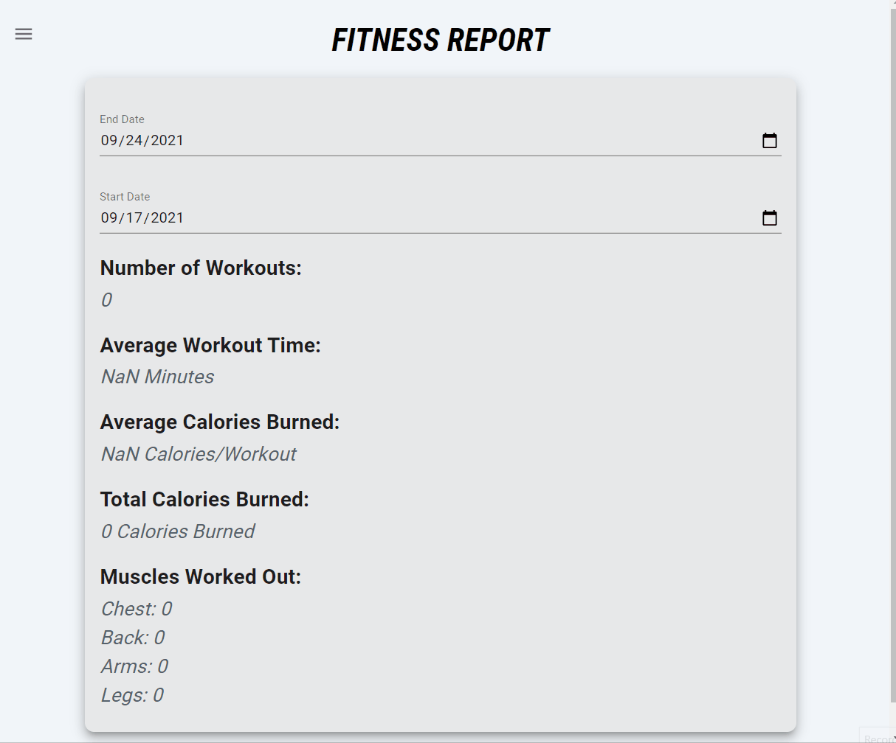

# GitFit

This is a web application for people who want to get fit with other people!

This is a full-stack application that utilizes HTML, CSS, JavaScript, React.js, Material UI in the front end, and Node.js, Express.js, and postgresql in the back end. I also use lodash and date.fns throughout the application.

I wanted to make this application for my friends who are just getting into fitness. Fitness is something that is great to get into, but one of the hardest things about it is consistency! Hopefully, this app can help them and anyone else improve their fitness!

## Live Deployment Link
Try the application at: [https://mygitfit.herokuapp.com](https://mygitfit.herokuapp.com)

## Stack
HTML, CSS, JavaScript, React.js, Material UI, Node.js, Express.js, postgresql, lodash, date.fns, AWS, mime, multer, multer-s3, Argon2, jsonwebtoken, Babel, Webpack

## Features
1. User can record a workout that they did
1. User can record a meal that they ate
1. User can see their past workouts
1. User can see their past meals
1. User can see an analysis of their workouts
1. User can set the starting date and ending date of the analysis
1. User can see a list of other users
1. User can see the workouts of other users
1. User can see the meals of other users

## Stretch Features for the Future
1. Allow users to post the gyms that they have worked out at
1. Allow users to rate the gyms that they have worked out at
1. Allow users to view the gyms that others have gone to
1. Allow users to comment on the gym postings
1. Allow users to set up tourneys to see who has the best fitness

## Preview



### Getting Started

1. Clone the repository.

    ```shell
    git clone https://github.com/dennymin/gitfit.git
    cd gitfit
    ```

1. Install all dependencies with NPM.

    ```shell
    npm install
    ```

1. Start the postgresql server

    ```shell
    sudo service postgresql start
    ```

1. Import data

    ```shell
    npm run db:import
    ```

1. Start up the database

    ```shell
    pgweb --db=gitfit
    ```

1. In another shell window, run the npm script to start both the client and the server

    ```shell
    npm run dev
    ```

1. In your browser, visit localhost:3000 to see and use the application
